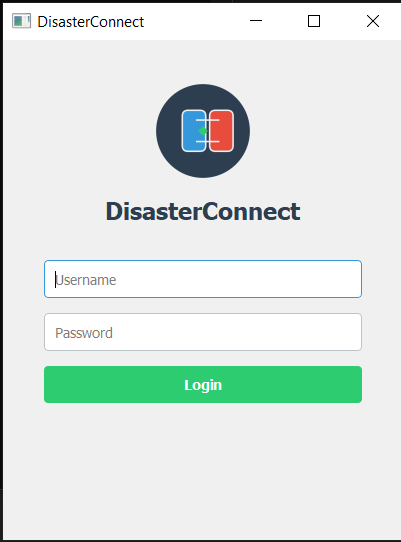
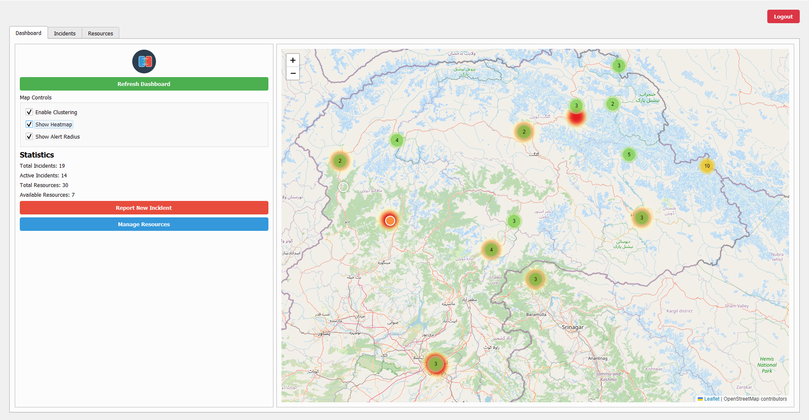
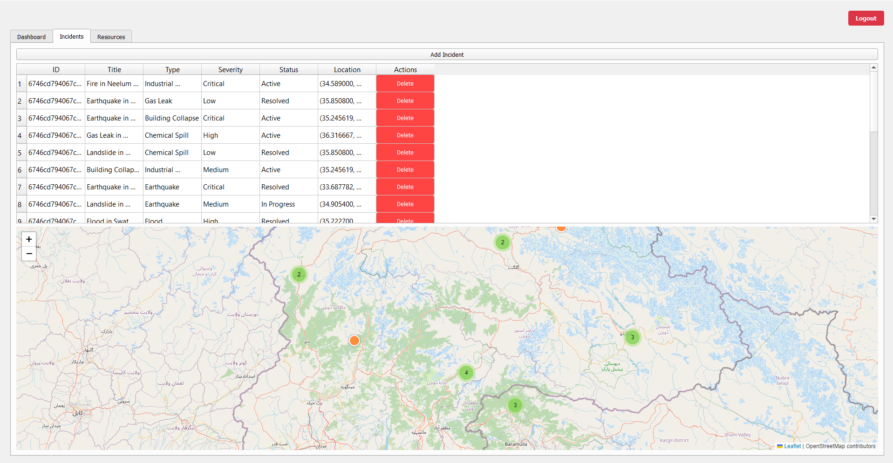
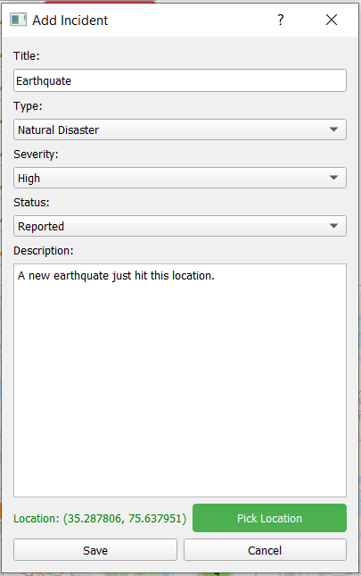
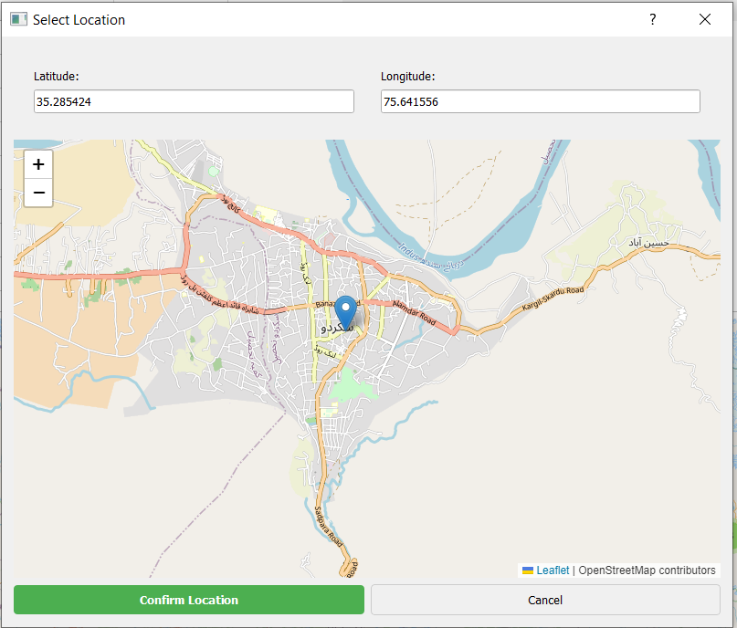

# DisasterConnect

[](https://opensource.org/licenses/MIT)
[](https://www.python.org/downloads/)
[](http://makeapullrequest.com)

A real-time disaster response coordination platform that helps connect resources with those in need during emergencies. This open-source project aims to provide a robust solution for disaster management teams worldwide.

## 🚀 Features

- 🌍 Real-time incident tracking with interactive map visualization
- 📊 Resource allocation and tracking system
- 💬 Communication system for coordinators
- ✅ Task management for response teams
- 📱 Responsive desktop interface
- 🔒 Secure authentication system
- 📊 Data visualization and reporting

## 🛠️ Tech Stack

- **Backend:** Python 3.11
- **Database:** MongoDB
- **UI Framework:** PyQt5
- **Maps:** Interactive mapping library
- **Authentication:** JWT-based auth
- **Reporting:** ReportLab, Matplotlib

## 📋 Prerequisites

- Python 3.11 or higher
- MongoDB
- Git

## 🚀 Quick Start

1. Clone and setup:
```bash
git clone https://github.com/Razee4315/DisasterConnect.git
cd DisasterConnect
python -m venv venv
source venv/bin/activate  # On Windows: venv\Scripts\activate
pip install -r requirements.txt
```

2. Configure environment:
```bash
cp .env.example .env
# Edit .env with your configuration
```

3. Run the application:
```bash
python src/main.py
```

## 📖 Documentation

- [User Guide](docs/USER_GUIDE.md) - Detailed application usage
- [API Documentation](docs/API.md) - API endpoints and usage
- [Contributing Guidelines](CONTRIBUTING.md) - How to contribute
- [Code of Conduct](CODE_OF_CONDUCT.md) - Community guidelines
- [Security Policy](SECURITY.md) - Security and vulnerability reporting
- [Changelog](CHANGELOG.md) - Version history and changes

## 🤝 Contributing

We believe in the power of community collaboration! Whether you're fixing bugs, adding features, or improving documentation, your contributions are welcome.

1. Fork the repository
2. Create your feature branch (`git checkout -b feature/AmazingFeature`)
3. Commit your changes (`git commit -m 'Add some AmazingFeature'`)
4. Push to the branch (`git push origin feature/AmazingFeature`)
5. Open a Pull Request

See [CONTRIBUTING.md](CONTRIBUTING.md) for detailed guidelines.

## 🔒 Security

We take security seriously. If you discover any security-related issues, please follow our [Security Policy](SECURITY.md).

## 📸 Interface Screenshots

Here's a visual tour of DisasterConnect's key features:

### 1. Login Interface

*Secure authentication portal with role-based access control.*

### 2. Dashboard Overview

*Comprehensive dashboard providing real-time insights and critical information at a glance.*

### 3. Incident Management

*Efficient incident tracking and management interface with priority indicators.*

### 4. Resource Allocation

*Resource tracking and allocation system for optimal distribution of emergency resources.*

### 5. Map Visualization

*Interactive map interface showing incident locations and resource distribution.*

### 6. Communication Hub

*Real-time communication platform for coordinating response efforts.*

### 7. Analytics Dashboard

*Advanced analytics and reporting tools for data-driven decision making.*

## 💬 Community and Support

- 📫 Contact: saqlainrazee@gmail.com
- 🐛 [Report bugs](https://github.com/Razee4315/DisasterConnect/issues)
- 💡 [Request features](https://github.com/Razee4315/DisasterConnect/issues)
- 👥 [Discussions](https://github.com/Razee4315/DisasterConnect/discussions)

## 📄 License

This project is licensed under the MIT License - see the [LICENSE](LICENSE) file for details.

## 👨‍💻 Author

- **Saqlain Razee** - [Razee4315](https://github.com/Razee4315)

## 🙏 Acknowledgments

- All our amazing contributors
- The open-source community
- Libraries and tools that make this project possible

---
⭐ Star this repository if you find it helpful!
